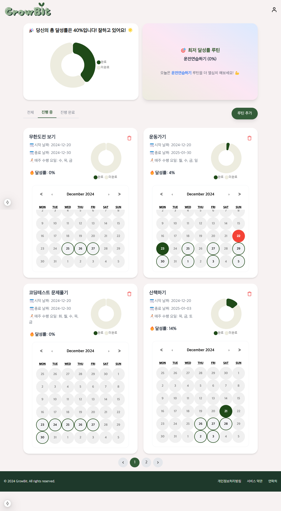

# 🌱GrowBit

루틴 성장 관리 애플리케이션

## 📍개발 기간

2024.12 ~

## 📍주요 기능

### 1️⃣ 루틴 관리

- **루틴 추가/수정/삭제**: 사용자는 새로운 루틴을 추가하고, 삭제할 수 있습니다.
- **Firestore 연동**: 루틴 데이터는 Firestore에 저장되어 실시간으로 동기화됩니다.

### 2️⃣ 루틴 달성률 시각화

- **Chart.js**: 루틴 달성률을 그래프 형태(도넛 차트)로 시각화해 사용자가 얼마나 목표를 달성했는지 쉽게 확인할 수 있습니다.

### 3️⃣ 친구 관리

- **친구 추가/삭제**: 사용자는 닉네임으로 친구를 추가할 수 있습니다.

### 4️⃣ PWA 지원 + 알림

- 사용자는 앱을 홈 화면에 추가하여 네이티브 앱처럼 사용할 수 있습니다.
- `next-pwa` 패키지 설정 및 `service worker` 등록
- `manifest.json` 파일 작성으로 앱 이름, 아이콘 설정
- Firebase Cloud Messaging(FCM)을 사용하여 사용자가 설정한 루틴 알림을 놓치지 않도록 푸시 알림 발송

## 📍기술 스택

- Next.js App Router, Firebase, Chart.js, react-picker, react-calendar, Tailwind CSS, eslint, prettier, next-pwa

> TODO  
> 목표 공유 기능: 사용자 간 목표를 공유하고 비교할 수 있는 기능을 제공하기
